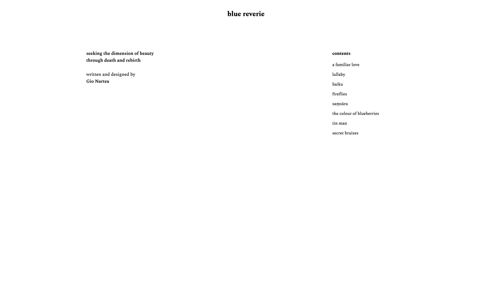
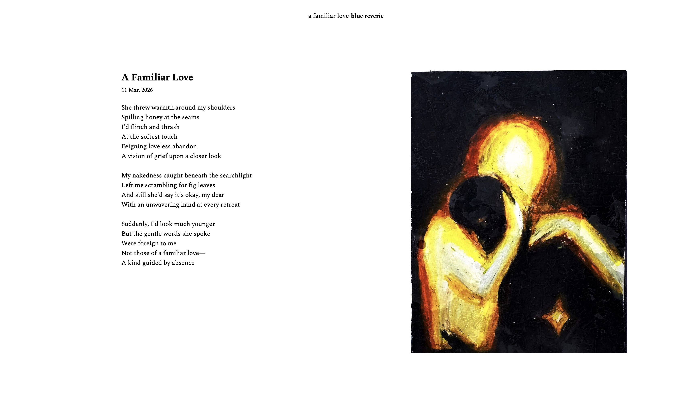
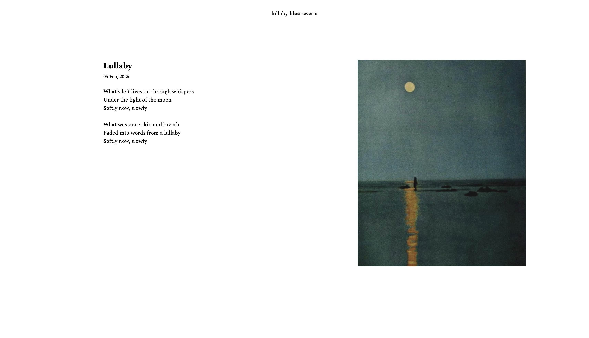
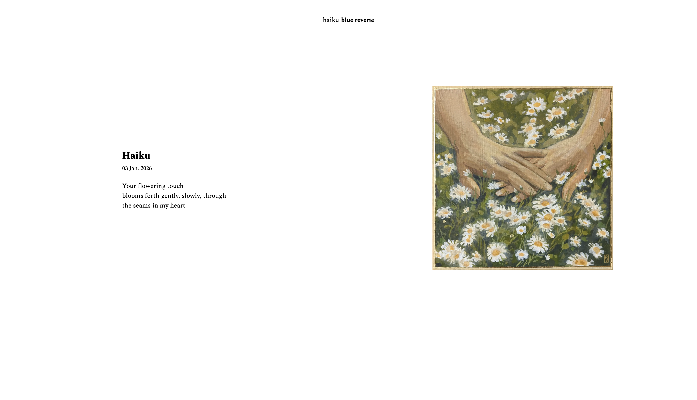
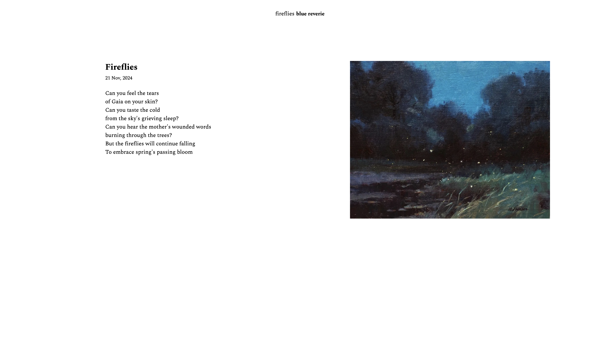
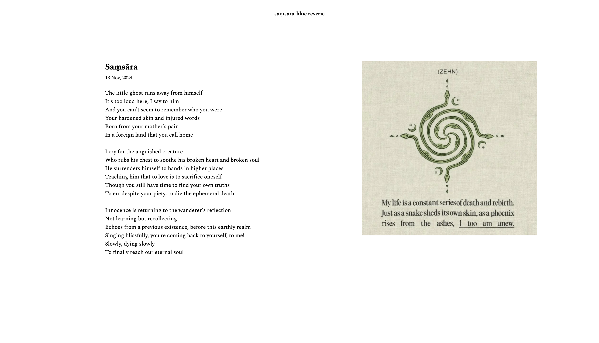
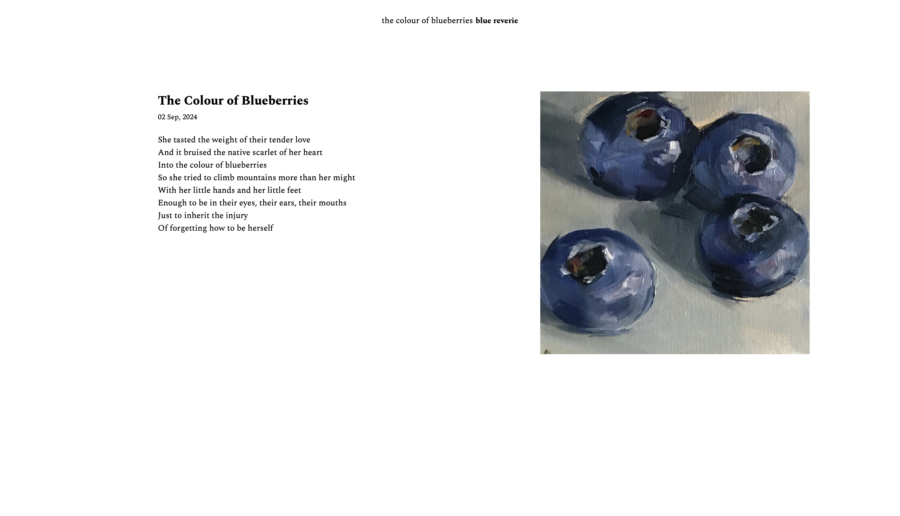
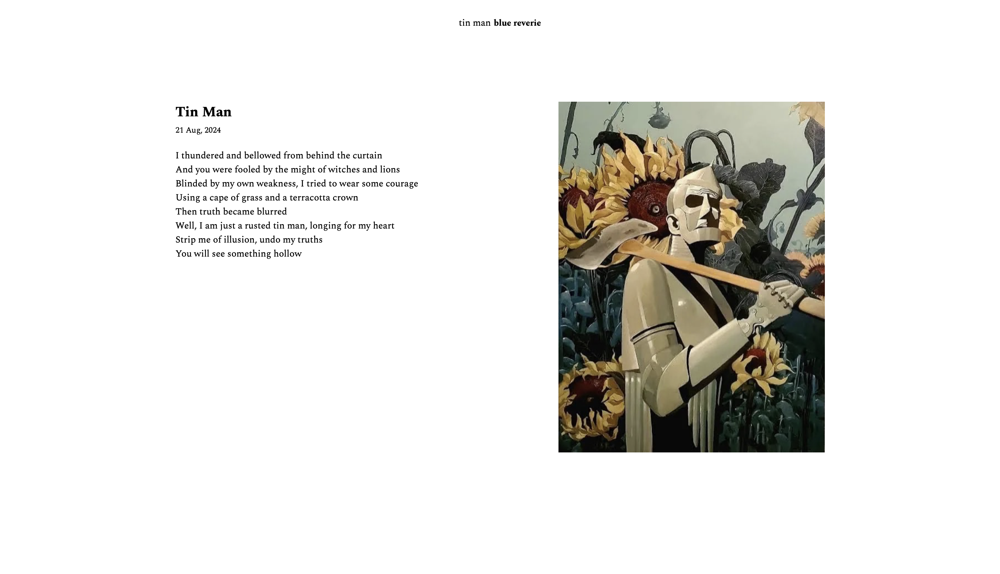
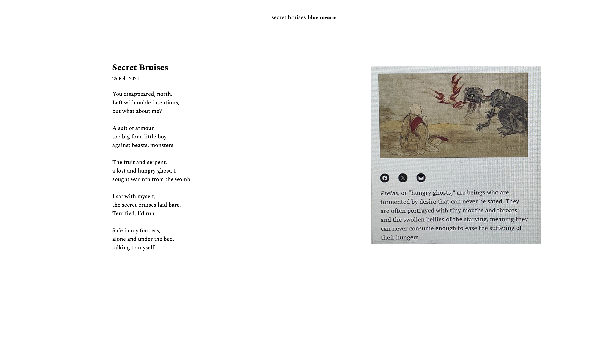

# Blue Reverie

reverie 
*noun* 
(a state of having) pleasant dream-like thoughts. 
 
<a href="https://en.wikipedia.org/wiki/Blue_in_culture">
<i> "Surveys in the US and Europe show that blue is the color most commonly associated with ... the imagination, cold, and occasionally with sadness." </i>
</a>
#
A website to showcase my original poetry, exploring the search for beauty and meaning in the bitterwseet cycle of change. 
 
The minimalistic design was heavily inspired by *Paperwork: The Potential of Paper in Graphic Design* by Nancy Williams, a book I discovered in the house where I was living in Australia.

<!--  -->

